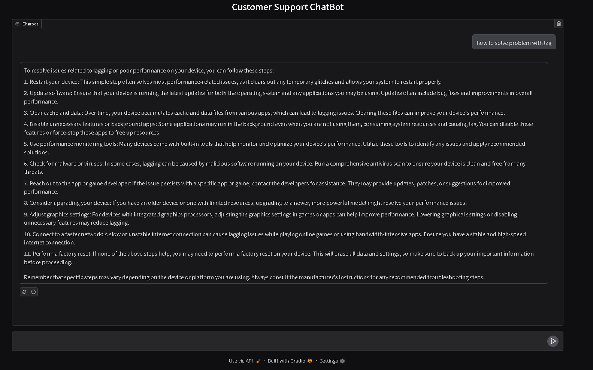

# Customer Support Chatbot

This project is an AI-powered customer support chatbot designed to assist users with technical, billing, and general inquiries. It leverages advanced natural language processing and machine learning techniques to provide helpful, conversational responses based on historical support tickets.

## Features
- **Conversational Chatbot UI**: Built with [Gradio](https://gradio.app/) for an interactive web interface.
- **Contextual Responses**: Uses [Ollama](https://ollama.com/) for generating friendly, context-aware replies.
- **Text Processing**: Utilizes [NLTK](https://www.nltk.org/) for stopword removal and lemmatization.
- **Similarity Search**: Employs [scikit-learn](https://scikit-learn.org/) (TF-IDF and cosine similarity) to match user queries with past tickets.
- **Data Handling**: Processes and analyzes support ticket data with [pandas](https://pandas.pydata.org/).
- **Kaggle Integration**: Designed to work with datasets from [Kaggle](https://www.kaggle.com/).

## How It Works
1. **Preprocessing**: Cleans and lemmatizes ticket data for efficient search and matching.
2. **Similarity Matching**: Finds the most relevant past ticket using TF-IDF and cosine similarity.
3. **Response Generation**: Crafts a conversational reply using Ollama, optionally referencing matched ticket details.
4. **User Interface**: Users interact with the chatbot via a simple Gradio web app.

## Demo



## Requirements
- Python 3.8+
- pandas
- gradio
- nltk
- scikit-learn
- ollama (Python client)

## Setup
1. Clone this repository.
2. Install dependencies:
   ```bash
pip install -r requirements.txt
   ```
3. Download required NLTK data (the app will attempt to do this automatically):
   ```python
   import nltk
   nltk.download('stopwords')
   nltk.download('wordnet')
   nltk.download('omw-1.4')
   ```
4. Ensure Ollama is running locally and the desired model (e.g., `llava`) is available.
5. Place your support ticket dataset (e.g., from Kaggle) in the appropriate location as expected by `data.py`.
6. Run the app:
   ```bash
   python main.py
   ```

## Usage
- Open the Gradio interface in your browser.
- Type your support question or select an example.
- The chatbot will respond with a helpful, friendly answer.

## Customization
- You can modify the prompt and response logic in `main.py` to suit your support style or business needs.
- Update the dataset or preprocessing steps as required for your data.

## License
This project is for educational and demonstration purposes.
